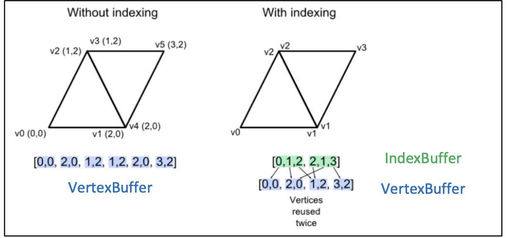
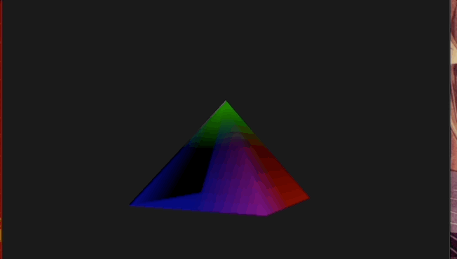

# Introduction to Computer Graphics tp-2

In this tutorial, you will learn how to create a 3D pyramid. We'll cover concepts such as VBOs, IBOs, transformations, and shader uniforms.

## VBOs

In OpenGL, vertices are the building blocks of shapes. They represent points in 3D space. To render a pyramid, we need to define its vertices. The pyramid consists of a base and an apex. Each vertex is represented by three floating-point numbers (x, y, z) to specify its position(and optionally u,v for texture mapping).

## IBOs

Indices are used to specify the order in which vertices should be connected to form shapes. For the pyramid, we need indices to draw each face properly. This includes indices for the base and the triangular side faces.




## Step 1: Defining VBOs and IBOs for the Pyramid

Duplicate the Triangle Class and create a new class Pyramid. Add VBO's for the pyramid

```cpp
GLfloat vertex_buffer_data[] = {
    -0.5f, -0.5f, -0.5f,  // Vertex 0
    ... // add the remaining vertices here
    0.0f,  0.5f,  0.0f   // Vertex 4
};
```

Now, create the IBO's to index these vertices.

```cpp
GLint indices[] = {
    // Base indices
    0, 1, 2,  // Triangle 1
    ... // add the remaining indices for the base
    // Side faces indices
    0, 4, 1,  // Side face 1
    ... // add the remaining indices for the sides
};
```

## Step 2: Binding Buffers

Before rendering the pyramid, we need to bind the vertex buffer and index buffer. Binding buffers tells OpenGL which buffer to use for rendering. 

```cpp
// Bind vertex buffer
glBindBuffer(GL_ARRAY_BUFFER, buffers[0]);
glBufferData(GL_ARRAY_BUFFER, sizeof(vertex_buffer_data), vertex_buffer_data, GL_STATIC_DRAW);

// Bind index buffer
glBindBuffer(GL_ELEMENT_ARRAY_BUFFER, buffers[1]);
glBufferData(GL_ELEMENT_ARRAY_BUFFER, sizeof(indices), indices, GL_STATIC_DRAW);
```

## Step 3: Draw

After binding, use the `glDrawElements` in `draw()` to render the pyramid(note that a pyramid requires 6 triangles so we modify our draw call with 6 x 3 = 18 vertices).

```cpp
glDrawElements(GL_TRIANGLES, 18, GL_UNSIGNED_INT, 0);
```

Our pyramid still looks like a triangle, this is because we don't have perspective projection.


To fix this, we will use transformations using shader [uniforms](https://www.khronos.org/opengl/wiki/Uniform_(GLSL)).

## Step 4: Applying Transformations

Transformations are used to manipulate the position, rotation, and scale of objects in 3D space. To position and rotate the pyramid, we'll use the  following transformation matrices in the `draw()` function.

```cpp
// Compute rotation angle
float rotation = glm::radians(45.0f + glfwGetTime());
// Create scale matrix
glm::mat4 sca_mat = glm::scale(glm::mat4(1.0f), glm::vec3(1.0f, 1.0f, 1.0f));
// Create rotation matrix
glm::mat4 rot_mat = glm::rotate(glm::mat4(1.0f), rotation, glm::vec3(0, 1, 0));
// Create translation matrix
glm::mat4 tra_mat = glm::translate(glm::mat4(1.0f), glm::vec3(0.0f, 0.0f, -3.0f));
// Combine translation and rotation
glm::mat4 view = tra_mat * rot_mat * sca_mat;

// Add perspective matrix
glm::mat4 proj_mat = glm::perspective(glm::radians(45.0f), 1.0f, 0.1f, 10.0f);
```

Now, send these transformation matrices as uniforms to our shader.

**OpenGL Function:**
```cpp
// get location of view uniform in the shader
GLint loc = glGetUniformLocation(this->shader_program_, "view");

// send the matrix as a uniform
glUniformMatrix4fv(loc, 1, GL_FALSE, glm::value_ptr(view));

// repeat for the projection matrix
...
```

## Step 5: Modifying the Vertex Shader

The vertex shader is responsible for processing vertex data before rendering. We'll update the vertex shader to accept transformation matrices as uniform variables.

```glsl
#version 330 core

// Input attribute variable, given per vertex
in vec3 position;

// Global matrix variables
uniform mat4 view;
uniform mat4 projection;


void main() {
    fragColor = position;
    // Apply transformation to the vertex position
    gl_Position = projection * view * vec4(position, 1);
}
```



## Bonus: Gradient and Sending Colors

Color your pyramid using a gradient based on the position of the vertex(hint, OpenGL does color interpolations automatically). You can also try sending colors from the draw call using uniforms.

## Bonus: Try other 3D shapes

Try modeling other 3D shapes by applying the same principle.

## Bonus: Implement mouse and keyboard controls

Check out the glfw input [guide](https://www.glfw.org/docs/3.3/input_guide.html) to implement basic mouse and keyboard navigation in your scene.
